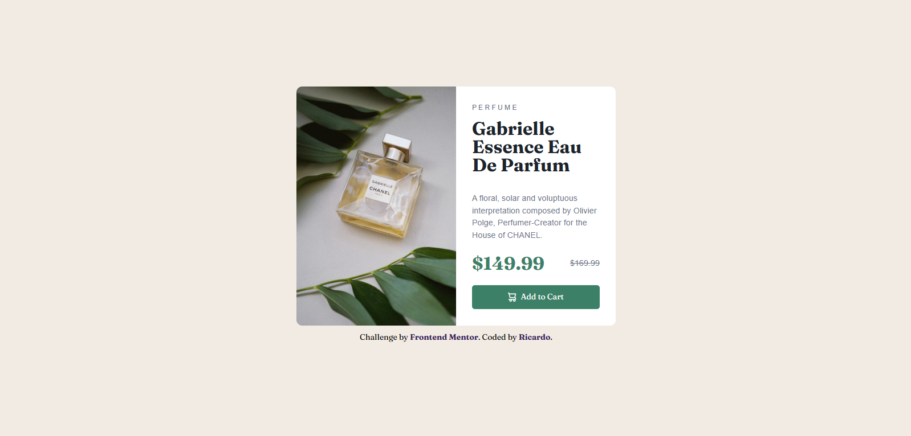

# Frontend Mentor - Product preview card component solution

This is a solution to the [Product preview card component challenge on Frontend Mentor](https://www.frontendmentor.io/challenges/product-preview-card-component-GO7UmttRfa). Frontend Mentor challenges help you improve your coding skills by building realistic projects. 

## Table of contents

- [Overview](#overview)
  - [The challenge](#the-challenge)
  - [Screenshot](#screenshot)
  - [Links](#links)
- [My process](#my-process)
  - [Built with](#built-with)
  - [What I learned](#what-i-learned)
  - [Continued development](#continued-development)
- [Author](#author)

## Overview

### The challenge

Users should be able to:

- View the optimal layout depending on their device's screen size
- See hover and focus states for interactive elements

### Screenshot



### Links

- Solution URL: [https://github.com/rc-0105/Product-preview-card-component](https://github.com/rc-0105/Product-preview-card-component)
- Live Site URL: [https://rc-0105.github.io/Product-preview-card-component/](https://rc-0105.github.io/Product-preview-card-component/)

## My process

### Built with

- Semantic HTML5 markup
- CSS custom properties
- Flexbox
- CSS Grid

### What I learned

In the process on making this project i learned a lot of things, i have to admit that was a difficult journey cause i had to force myself to learn responsive css and html.

I learned about rems and ems, this units helps making the different type of styles responsive like in margin or padings

```css
.product-price-discount{
    text-decoration: line-through;
    margin-left: 1em;
}
```
or font sizes 

```css
.product-price{
    font-family: 'Fraunces', sans-serif;
    color: hsl(158, 36%, 37%);
    font-weight: 700;
    font-size: 2rem;
}
```
Also i learned how to manage multiple images, and make them appear depending on the screen size

```html
<picture >
      <source srcset="./images/image-product-desktop.jpg" media="(min-width: 586px)">
      <source srcset="./images/image-product-mobile.jpg" media="(max-width: 585px)">
      
    </picture>
```

### Continued development

In the next projects ill be thinking first how to manage differents viewports of the users before adding stuff that could make me roll back and changes things.

## Author

- Website - [Ricardo](https://github.com/rc-0105)
- Frontend Mentor - [@rc-0105](https://www.frontendmentor.io/profile/rc-0105)

